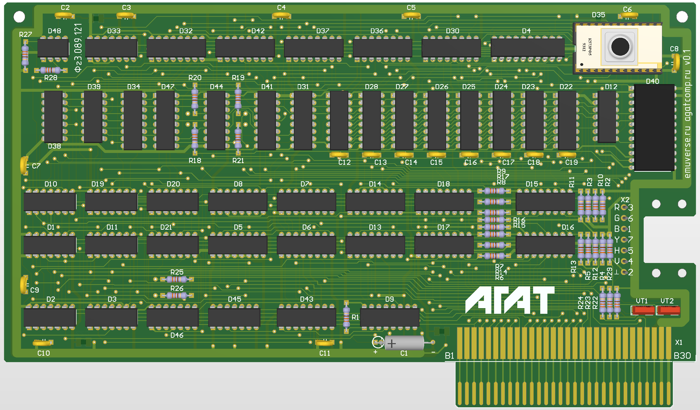
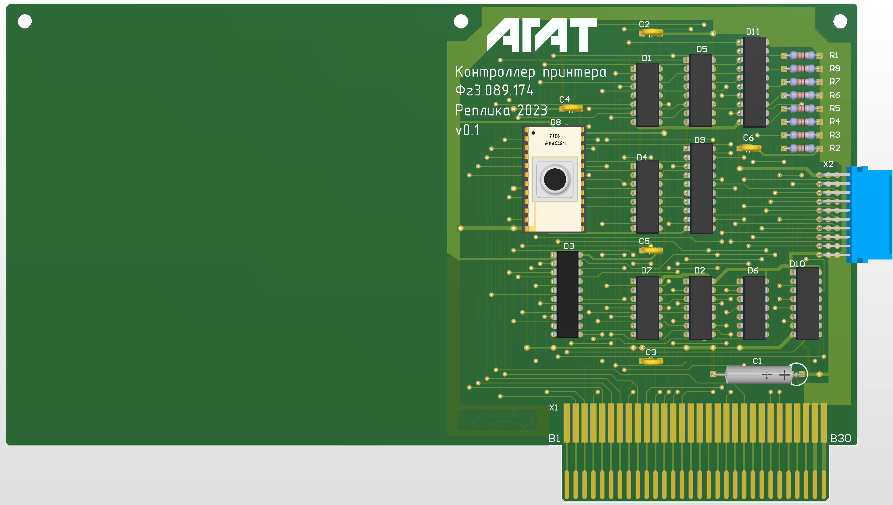
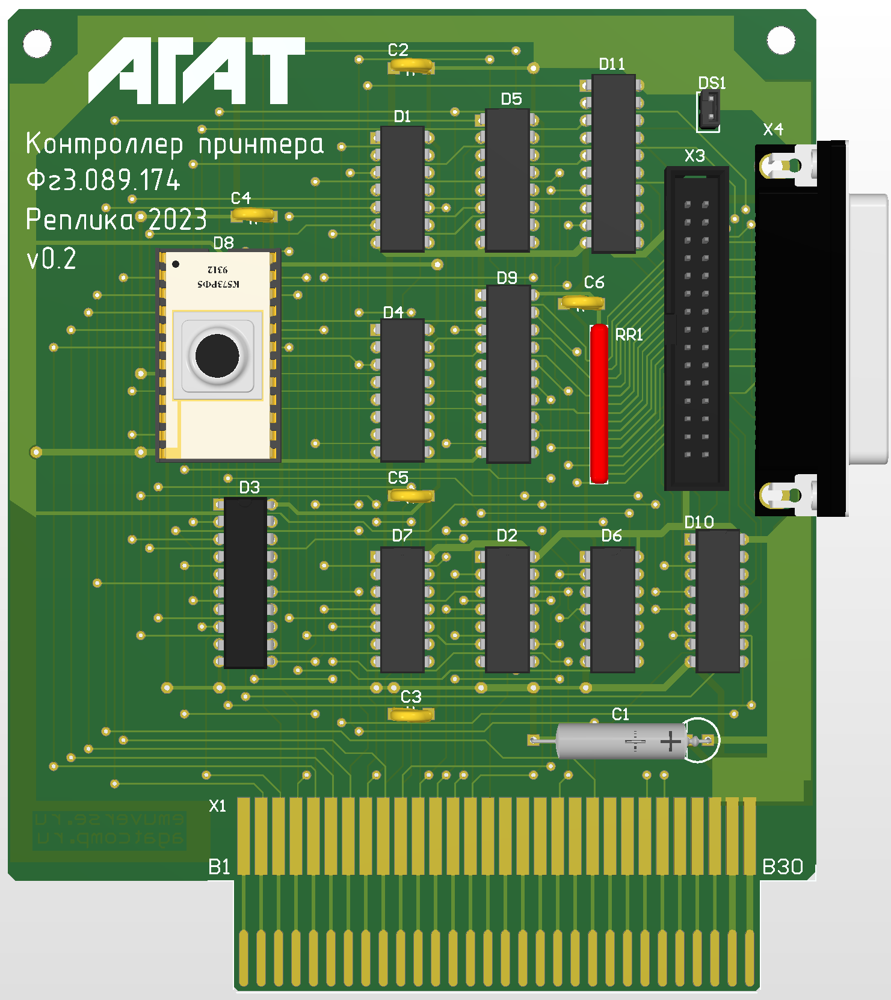

# Платы расширения для компьютера Агат

Платы созданы на основе информации с сайта [agatcomp.ru](http://agatcomp.ru)

## Ячейка 121 (Фг3.089.121)

Официальное название "Модуль дисплейного контроллера". Представляет собой видеокарту для Агата-7, программно совместимую с контроллером дисплея "Apple ]["

* [Страница на сайте](http://agatcomp.ru/agat/Hardware/GenPlat/j121.shtml)
* [Тестовое описание](docs/121_описание.pdf)
* [Документация на реплику (PDF)](fabrication/Agat_Cell_121_E3.PDF)
* [Gerber-файлы](fabrication/Cell_121_Gerbers)

## Контроллер принтера Фг3.089.174

Реплика выполнена в двух вариантах: 100% копия и укороченный вариант с современными разъемами.

 

* [Страница на сайте](http://agatcomp.ru/agat/Hardware/IO/io9.shtml)
* [Документация на реплику, (копия, PDF)](fabrication/Agat_IO9_(SNP)_E3.PDF)
* [Gerber-файлы (копия)](fabrication/IO9_SNP_Gerbers)
* [Документация на реплику, (модификация, PDF)](fabrication/Agat_IO9_(IDC)_E3.PDF)
* [Gerber-файлы (модификация)](fabrication/IO9_IDC_Gerbers)
* 3D-модель разъема СНП взята из проектов [Олега Одинцова](https://sourceforge.net/projects/agat-hardware/).